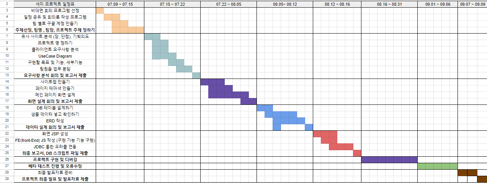
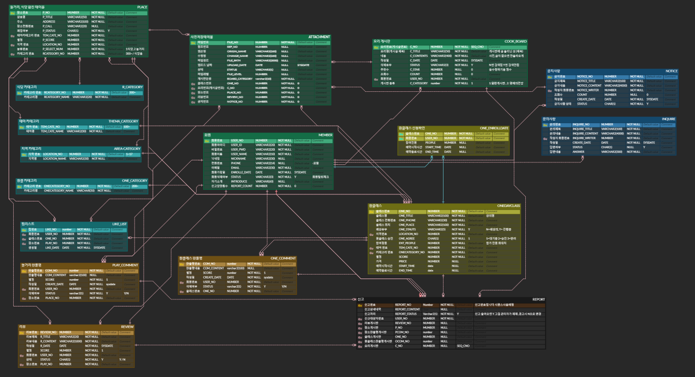
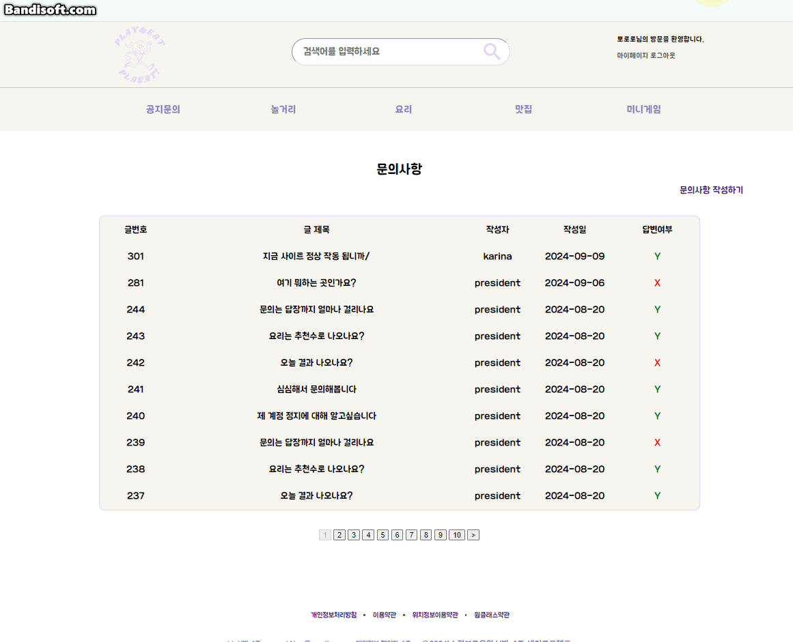
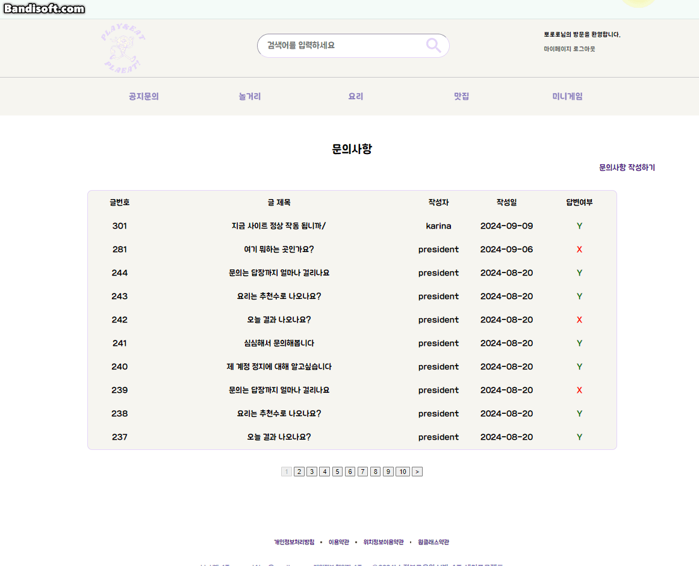
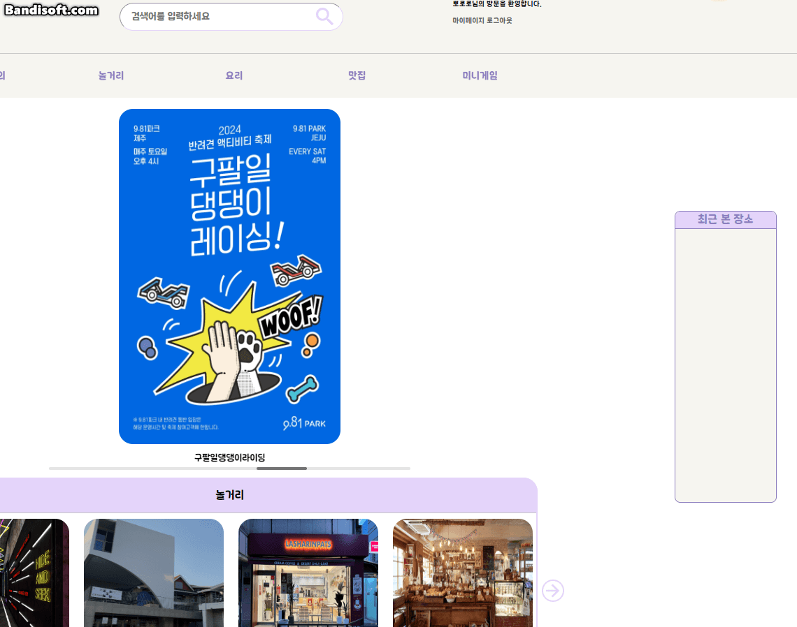
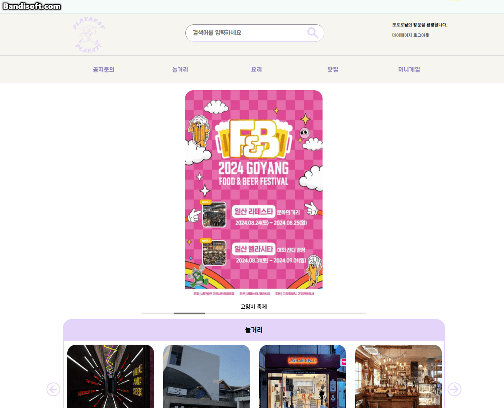

# 🍦세미프로젝트 4조 : 점심4조

# 🚩프로젝트 소개

다양한 정보를 얻기 위해 여러사이트를 돌아다닐 필요없이 한 사이트에서 사용자들이 대부분의 정보를 얻을수 있으며 친구 또는 연인들이 즐거운 하루를 보낼수 있도록 정보를 드리는 것이 저희가 사이트를 만든 이유입니다.

# 🙌구성원 및 역할

- **조장 : 이준영**

  - 관리자 페이지 회원 수 및 회원목록 조회
  - 관리자 페이지 게시글 관리
  - 관리자 페이지 신고 접수 및 회원 제재
  - 관리자 페이지 문의사항 확인 및 답변
  - 새로운 맛집 및 놀거리 등록 / 수정

- **조원 : 이승헌**

  - 메인 페이지
  - 최근 본 목록 뱃지 (세션 사용)
  - 공지사항 게시판 (사진포함 등록, 삭제, 수정)
  - 문의사항 게시판 (사진포함 등록, 삭제, 수정)
  - 사다리타기 미니게임 (오픈소스 활용)

- **조원 : 오명식**

  - 마이페이지
  - 회원 정보 수정 및 탈퇴
  - 본인이 작성한 리뷰 및 문의사항 조회 / 수정
  - 좋아요 누른 게시글에 대한 찜 리스트 조회

- **조원 : 정민식**

  - 로그인 및 회원가입 (카카오 API)
  - 아이디 및 비밀번호 찾기
  - 원데이 클래스 및 맛집 상세페이지 (카카오 소셜 공유 사용)
  - 상세 검색 페이지 (네이버 지도 API)
  - 명예의 전당 페이지

- **조원 : 황영찬**
  - 놀거리 상세 페이지
  - 맛집 찾기 및 놀거리 찾기 메인페이지
  - 요리 게시판 메인 페이지 및 요리 게시글 상세페이지
  - 요리 게시글 작성, 수정, 삭제 및 추천 기능
  - 상세 검색 페이지 카테고리 구분s

# 💻개발 기간

- **2024.07.09 ~ 2024.07.15 : 주제선정, 팀명, 팀장 프로젝트 주제 정하기**
- **2024.07.15 ~ 2024.07.22 : 유사사이트 분석, 구현목표 및 기능, 요구사항 분석, UseCase Diagram**
- **2024.07.22 ~ 2024.08.05 : 사이트맵 만들기, 메인페이지 화면설계**
- **2024.08.05 ~ 2024.08.12 : DB테이블 설계, ERD 작성**
- **2024.08.12 ~ 2024.08.16 : 화면 JSP 생성, FE JS작성, JDBC통한 오라클 연동**
- **2024.08.16 ~ 2024.08.31 : 프로젝트 구현 및 디버깅**
- **2024.09.01 ~ 2024.09.06 : 베타테스트 진행 및 오류수정**
- **2024.09.07 ~ 2024.09.09 : 프로젝트 최종 발표 및 발표자료 제출**

# 🔎개발환경

- **OS** : Windows10
- **Developer Tools** : Eclipse / VS Code / SqlDeveloper
- **Server** : Apach Tomcat 9.0
- **DBMS** : Oracle
- **Management** : Git, GitHub
- **Front-end** : HTML5 / CSS3 / JavaScript / jQuery / AJAX / JSON
- **BackEnd** : Java, JSP & Servlet
- **API** : 카카오 로그인 / 소셜 공유 API, 네이버 지도 API

# 🔗테이블 설계

# 🎮프로젝트 구현

- **🔴조장 : 이준영**
    

    
관리자페이지

    - - 🔴관리자 메인페이지

    

    ---
    - - 🔴문의사항
    - 문의사항목록  
    - 답변하기 
        
    - - 🔴장소 관리
    - 장소 목록
    - 장소 검색
    - 장소 수정
    - 장소 폐업처리
    - 장소 추가하기

    - - 🔴게시판 관리
    - 게시판 목록
    - 게시판 글 삭제
    - - 🔴원클래스 관리
    - 원클래스 목록
    - 원클래스 수정
    - 원클래스 등록
    - 원클래스 삭제\
    - - 🔴회원 관리
    - 회원 목록
    - 회원 제제
    - - 🔴신고 관리
    - 신고 목록
    - 신고 제제
    - 신고 제제없음
    

   
- **🟡조원 : 이승헌**
    - 🟡 공지사항 들어갈 때
    

    - 🟡 공지사항 등록
    

    - 🟡 공지사항 수정
    

    - 🟡 메인 페이지 
    

    - 🟡 문의사항 목록 
    

    - 🟡 문의사항 작성자 확인
    

    - 🟡 공지사항 작성자 본인
    

    - 🟡 최근 본 목록 뱃지
    

    - 🟡 사다리타기
    

    - 🟡 자주 하는 질문
    

---

- **🟢조원 : 오명식**

---

- **🔵조원 : 정민식**
  
  - 🔵로그인 화면
    [로그인](./semi/WebContent/resources/ReadMe/정민식/로그인.gif)

  - 🔵아이디 저장
    [아이디 저장](./semi/WebContent/resources/ReadMe/정민식/아이디%20저장.gif)

  - 🔵아이디 찾기
    [아이디 찾기](./semi/WebContent/resources/ReadMe/정민식/아이디%20찾기.gif)

  - 🔵비밀번호 찾기 후 변경
    [비밀번호 찾기 / 변경](./semi/WebContent/resources/ReadMe/정민식/비밀번호%20찾기%20및%20변경.gif)

  - 🔵카카오 로그인
    [카카오 로그인](./semi/WebContent/resources/ReadMe/정민식/카카오%20로그인.gif)

  - 🔵회원가입
    [회원가입](./semi/WebContent/resources/ReadMe/정민식/회원가입.gif)

  - 🔵원데이 클래스 상세 화면
    [원데이클래스 상세](./semi/WebContent/resources/ReadMe/정민식/원데이.gif)

  - 🔵카카오, 네이버 공유하기
    [공유하기](./semi/WebContent/resources/ReadMe/정민식/공유하기.gif)

  - 🔵한줄평 작성
    [한줄평 작성](./semi/WebContent/resources/ReadMe/정민식/한줄평%20작성.gif)

  - 🔵더보기 버튼
    [더보기 버튼](./semi/WebContent/resources/ReadMe/정민식/더보기%20버튼.gif)

  - 🔵식당 상세
    [식당상세](./semi/WebContent/resources/ReadMe/정민식/식당상세.gif)

  - 🔵리뷰 작성
    [리뷰 작성](./semi/WebContent/resources/ReadMe/정민식/리뷰%20작성.gif)

  - 🔵리뷰 수정
    [리뷰 수정](./semi/WebContent/resources/ReadMe/정민식/리뷰%20수정.gif)

  - 🔵리뷰 삭제
    [리뷰 삭제](./semi/WebContent/resources/ReadMe/정민식/리뷰%20삭제.gif)

  - 🔵네이버지도API 및 마커
    [네이버 지도](./semi/WebContent/resources/ReadMe/정민식/지도%20마커.gif)

---

- **🟣조원 : 황영찬**

    - 🟣놀거리 메인페이지
     

    - 🟣놀거리 상세 페이지 
     
    - 🟣댓글 달기
    
    
    - 🟣맛집 메인 페이지
    

    - 🟣요리게시판 (비회원)
    
    
    - 🟣요리게시판 상세
    

    - 🟣요리게시판 글 등록
    
    
    - 🟣요리게시판 수정
    
    
    - 🟣요리게시판 삭제
    

    - 🟣상세검색 페이지 카테고리
    

---

# 💬스크립트

SQL 스크립트

    --테이블 삭제 구문
    DROP TABLE ATTECHMENT;
    DROP TABLE COOK_BOARD;
    DROP TABLE INQUIRE;
    DROP TABLE LIKE_LIST;
    DROP TABLE NOTICE;
    DROP TABLE ONE_COMMENT;
    DROP TABLE ONE_ENROLLDATE;
    DROP TABLE ONEDAYCLASS;
    DROP TABLE PLAY_COMMENT;
    DROP TABLE REPORT;
    DROP TABLE REVIEW;
    DROP TABLE MEMBER;
    DROP TABLE ONE_CATEGORY;
    DROP TABLE PLACE;
    DROP TABLE R_CATEGORY;
    DROP TABLE THEMA_CATEGORY;
    DROP TABLE AREA_CATEGORY;

    --시퀀스 삭제 구문

    DROP  SEQUENCE COM_NO_SEQ;
    DROP  SEQUENCE COOK_BOARD_SEQ;
    DROP  SEQUENCE INQUIRE_SEQ;
    DROP  SEQUENCE LIKE_LIST_SEQ;
    DROP  SEQUENCE MEMBER_SEQ;
    DROP  SEQUENCE NOTICE_SEQ;
    DROP  SEQUENCE ONE_NO_SEQ;
    DROP  SEQUENCE PLAY_NO_SEQ;
    DROP  SEQUENCE PROFILE_SEQ;
    DROP  SEQUENCE REPROT_SEQ;
    DROP  SEQUENCE SEQ_ATTACHMENT;
    DROP  SEQUENCE SEQ_CNO;
    DROP  SEQUENCE SEQ_PCOMMENT;
    DROP  SEQUENCE SEQ_OCOMMENT;
    DROP  SEQUENCE SEQ_PLACE;
    DROP  SEQUENCE SEQ_REVIEW;

    -- 테이블 생성구문
    CREATE TABLE Member (
        USER_NO NUMBER PRIMARY KEY,
        USER_ID VARCHAR2(20) NOT NULL UNIQUE,
        USER_PWD VARCHAR2(20) ,
        USER_NAME VARCHAR2(10) NOT NULL,
        NICKNAME VARCHAR2(30),
        PHONE VARCHAR2(18),
        EMAIL VARCHAR2(30) NOT NULL UNIQUE,
        ENROLLE_DATE DATE DEFAULT SYSDATE NOT NULL ,
        STATUS VARCHAR2(3)  DEFAULT 'Y' NOT NULL,
        INTRODUCE VARCHAR2(60),
        REPORT_COUNT NUMBER DEFAULT 0 NOT NULL
    );

    CREATE TABLE ONE_CATEGORY (
        ONECATEGORY_NO NUMBER PRIMARY KEY,
        ONECATEGORY_NAME VARCHAR2(50) NOT NULL
    );

    CREATE TABLE THEMA_CATEGORY (
        TEM_CATE_NO NUMBER PRIMARY KEY,
        TEM_CATE_NAME VARCHAR2(30) NOT NULL
    );

    CREATE TABLE R_CATEGORY(
        RCATEGORY_NO NUMBER PRIMARY KEY,
        RCATEGORY_NAME VARCHAR2(20) NOT NULL
    );

    CREATE TABLE AREA_CATEGORY (
        LOCATION_NO NUMBER PRIMARY KEY,
        LOCATION_NAME VARCHAR2(30) NOT NULL
    );

    CREATE TABLE NOTICE (
        NOTICE_NO NUMBER PRIMARY KEY,
        NOTICE_TITLE VARCHAR2(100) NOT NULL,
        NOTICE_CONTENT VARCHAR2(4000) NOT NULL,
        NOTICE_WRITER NUMBER NOT NULL,
        COUNT NUMBER DEFAULT 0,
        CREATE_DATE DATE DEFAULT SYSDATE NOT NULL ,
        STATUS CHAR(1) DEFAULT 'Y' NOT NULL 
    );

    CREATE TABLE INQUIRE (
        INQUIRE_NO NUMBER PRIMARY KEY,
        INQUIRE_TITLE VARCHAR2(100) NOT NULL,
        INQUIRE_CONTENT VARCHAR2(4000) NOT NULL,
        INQUIRE_WRITER NUMBER NOT NULL,
        CREATE_DATE DATE DEFAULT SYSDATE NOT NULL ,
        STATUS CHAR(1) DEFAULT 'Y',
        ANSWER VARCHAR2(300) DEFAULT '아직 답변이 작성되지 않았습니다' NOT NULL
    );

    CREATE TABLE PLACE (
        P_NO NUMBER PRIMARY KEY,
        P_TITLE VARCHAR2(50) NOT NULL,
        ADDRESS VARCHAR2(100) NOT NULL,
        P_CALL VARCHAR2(20),
        P_STATUS CHAR(1) DEFAULT 'Y' NOT NULL,
        TEM_CATE_NO NUMBER,
        P_SCORE NUMBER ,
        LOCATION_NO NUMBER NOT NULL,
        P_SELECT_NUM NUMBER NOT NULL,
        RCATEGORY_NO NUMBER NOT NULL,
        BUSINESSTIME VARCHAR2(50) NOT NULL,
        FOREIGN KEY (TEM_CATE_NO) REFERENCES THEMA_CATEGORY (TEM_CATE_NO),
        FOREIGN KEY (LOCATION_NO) REFERENCES AREA_CATEGORY (LOCATION_NO),
        FOREIGN KEY (RCATEGORY_NO) REFERENCES R_CATEGORY (RCATEGORY_NO)
    );

    CREATE TABLE COOK_BOARD (
        C_NO NUMBER PRIMARY KEY,
        C_TITLE VARCHAR2(50) NOT NULL,
        C_CONTENTS VARCHAR2(400) NOT NULL,
        C_DATE DATE DEFAULT SYSDATE NOT NULL ,
        STATUS VARCHAR2(3) DEFAULT 'Y' NOT NULL ,
        C_STAR NUMBER DEFAULT 0,
        COUNT NUMBER DEFAULT 0,
        USER_NO NUMBER NOT NULL,
        C_CATEGORY NUMBER  DEFAULT 1 NOT NULL,
        FOREIGN KEY (USER_NO) REFERENCES Member (USER_NO)

    );

    CREATE TABLE ONEDAYCLASS (
        ONE_NO NUMBER PRIMARY KEY,
        ONE_TITLE VARCHAR2(100) NOT NULL,
        ONE_PHONE VARCHAR2(30) NOT NULL,
        ONE_PLACE VARCHAR2(100) NOT NULL,
        ONE_STATUS  VARCHAR2(5) DEFAULT 'Y' NOT NULL ,
        LOCATION_NO NUMBER NOT NULL,
        ONE_AGREE CHAR(1) DEFAULT '1' NOT NULL ,
        ENT_PEOPLE NUMBER NOT NULL,
        TEM_CATE_NO NUMBER NOT NULL,
        ONECATEGORY_NO NUMBER NOT NULL,
        SCORE NUMBER NOT NULL,
        PRICE NUMBER,
        START_TIME VARCHAR2(10),
        END_TIME VARCHAR2(10),
        FOREIGN KEY (LOCATION_NO) REFERENCES AREA_CATEGORY (LOCATION_NO),
        FOREIGN KEY (TEM_CATE_NO) REFERENCES THEMA_CATEGORY (TEM_CATE_NO),
        FOREIGN KEY (ONECATEGORY_NO) REFERENCES ONE_CATEGORY (ONECATEGORY_NO)
    );

    CREATE TABLE LIKE_LIST (
        LIKE_NO NUMBER PRIMARY KEY,
        USER_NO NUMBER NOT NULL,
        ONE_NO NUMBER DEFAULT 0 NOT NULL,
        PLAY_NO NUMBER DEFAULT 0 NOT NULL,
        LIKE_DATE DATE DEFAULT SYSDATE NOT NULL ,
        C_NO NUMBER DEFAULT 0 NOT NULL,
        STATUS VARCHAR2(5) DEFAULT'Y'
    );

    CREATE TABLE REVIEW (
        REVIEW_NO NUMBER PRIMARY KEY,
        R_TITLE VARCHAR2(100) NOT NULL,
        R_CONTENT VARCHAR2(1000) NOT NULL,
        R_DATE DATE DEFAULT SYSDATE NOT NULL ,
        SCORE NUMBER  DEFAULT 1 NOT NULL,
        USER_NO NUMBER NOT NULL,
        STATUS CHAR(1)  DEFAULT 'Y' NOT NULL,
        PLAY_NO NUMBER NOT NULL,
        FOREIGN KEY (USER_NO) REFERENCES Member (USER_NO),
        FOREIGN KEY (PLAY_NO) REFERENCES PLACE (P_NO)
    );

    CREATE TABLE ONE_ENROLLDATE (
        ONE_NO NUMBER PRIMARY KEY,
        USER_NO NUMBER NOT NULL,
        PEOPLE NUMBER,
        START_TIME DATE,
        END_TIME DATE,
        FOREIGN KEY (ONE_NO) REFERENCES ONEDAYCLASS (ONE_NO),
        FOREIGN KEY (USER_NO) REFERENCES Member (USER_NO)
    );

    CREATE TABLE PLAY_COMMENT (
        COM_NO NUMBER PRIMARY KEY,
        COM_CONTENT VARCHAR2(100),
        SCORE NUMBER DEFAULT 1 NOT NULL ,
        CREATE_DATE DATE DEFAULT SYSDATE NOT NULL ,
        USER_NO NUMBER NOT NULL,
        STATUS VARCHAR2(1)  DEFAULT 'Y' NOT NULL,
        PLACE_NO NUMBER NOT NULL,
        CONTENT_TYPE NUMBER NOT NULL,
    
        FOREIGN KEY (USER_NO) REFERENCES Member (USER_NO),
        FOREIGN KEY (PLACE_NO) REFERENCES PLACE (P_NO)
    );

    CREATE TABLE ONE_COMMENT (
        COM_NO NUMBER PRIMARY KEY,
        COM_CONTENT VARCHAR2(100),
        SCORE NUMBER  DEFAULT 1 NOT NULL,
        CREATE_DATE DATE  DEFAULT SYSDATE NOT NULL,
        USER_NO NUMBER NOT NULL,
        STATUS VARCHAR2(1) DEFAULT 'Y' NOT NULL ,
        ONE_NO NUMBER NOT NULL,
        CONTENT_TYPE NUMBER NOT NULL,
        FOREIGN KEY (USER_NO) REFERENCES Member (USER_NO),
        FOREIGN KEY (ONE_NO) REFERENCES ONEDAYCLASS (ONE_NO)
    );

    CREATE TABLE ATTECHMENT (
        FILE_NO NUMBER PRIMARY KEY,
        REF_NO NUMBER,
        ORIGIN_NAME VARCHAR2(260),
        CHANGE_NAME VARCHAR2(260),
        FILE_PATH VARCHAR2(2000),
        UPLOAD_DATE DATE DEFAULT SYSDATE,
        STATUS VARCHAR2(1),
        FILE_LEVEL NUMBER,
        BOARD_CATEGORY VARCHAR2(10) NOT NULL,
        ONE_NO NUMBER DEFAULT 0 NOT NULL ,
        C_NO NUMBER DEFAULT 0 NOT NULL ,
        PLACE_NO NUMBER  DEFAULT 0 NOT NULL,
        REVIEW_NO NUMBER DEFAULT 0 NOT NULL ,
        NOTICE_NO NUMBER DEFAULT 0 NOT NULL,
        FOREIGN KEY (ONE_NO) REFERENCES ONEDAYCLASS (ONE_NO),
        FOREIGN KEY (C_NO) REFERENCES COOK_BOARD (C_NO),
        FOREIGN KEY (PLACE_NO) REFERENCES PLACE (P_NO),
        FOREIGN KEY (REVIEW_NO) REFERENCES REVIEW (REVIEW_NO),
        FOREIGN KEY (NOTICE_NO) REFERENCES NOTICE (NOTICE_NO)
    );

    CREATE TABLE report (
        report_No	Number PRIMARY Key ,
        
        report_status	Varchar2(1) DEFAULT 'Y'	NOT NULL	,
        REVIEW_NO	NUMBER DEFAULT 0		NOT NULL,
        P_NO	NUMBER DEFAULT 0		NOT NULL,
        PCOM_NO	NUMBER DEFAULT 0		NOT NULL,
        ONE_NO	NUMBER DEFAULT 0		NOT NULL,
        OCOM_NO	number DEFAULT 0		NOT NULL,
        C_NO	NUMBER DEFAULT 0	 	NOT NULL,
        user_no number not null ,
        create_report date default sysdate not null 
    );

    --시퀀스 생성 구문

    CREATE  SEQUENCE COM_NO_SEQ;
    CREATE  SEQUENCE COOK_BOARD_SEQ;
    CREATE  SEQUENCE INQUIRE_SEQ;
    CREATE  SEQUENCE LIKE_LIST_SEQ;
    CREATE  SEQUENCE MEMBER_SEQ;
    CREATE  SEQUENCE NOTICE_SEQ;
    CREATE  SEQUENCE ONE_NO_SEQ;
    CREATE  SEQUENCE PLAY_NO_SEQ;
    CREATE  SEQUENCE PROFILE_SEQ;
    CREATE  SEQUENCE REPROT_SEQ;
    CREATE  SEQUENCE SEQ_ATTACHMENT;
    CREATE  SEQUENCE SEQ_CNO;
    CREATE  SEQUENCE SEQ_PCOMMENT;
    CREATE  SEQUENCE SEQ_OCOMMENT;
    CREATE  SEQUENCE SEQ_PLACE;
    CREATE  SEQUENCE SEQ_REVIEW;

    --  INSERT 문
    --AREA_CATEGORY INSERT 문
    Insert into AREA_CATEGORY (LOCATION_NO,LOCATION_NAME) values (7,'대전');
    Insert into AREA_CATEGORY (LOCATION_NO,LOCATION_NAME) values (1,'서울');
    Insert into AREA_CATEGORY (LOCATION_NO,LOCATION_NAME) values (2,'경기도');
    Insert into AREA_CATEGORY (LOCATION_NO,LOCATION_NAME) values (3,'인천');
    Insert into AREA_CATEGORY (LOCATION_NO,LOCATION_NAME) values (4,'대구');
    Insert into AREA_CATEGORY (LOCATION_NO,LOCATION_NAME) values (5,'광주');
    Insert into AREA_CATEGORY (LOCATION_NO,LOCATION_NAME) values (6,'부산');
    Insert into AREA_CATEGORY (LOCATION_NO,LOCATION_NAME) values (8,'울산');
    Insert into AREA_CATEGORY (LOCATION_NO,LOCATION_NAME) values (9,'세종');
    Insert into AREA_CATEGORY (LOCATION_NO,LOCATION_NAME) values (10,'강원도');
    Insert into AREA_CATEGORY (LOCATION_NO,LOCATION_NAME) values (11,'충청북도');
    Insert into AREA_CATEGORY (LOCATION_NO,LOCATION_NAME) values (12,'충청남도');
    Insert into AREA_CATEGORY (LOCATION_NO,LOCATION_NAME) values (13,'전라북도');
    Insert into AREA_CATEGORY (LOCATION_NO,LOCATION_NAME) values (14,'전라남도');
    Insert into AREA_CATEGORY (LOCATION_NO,LOCATION_NAME) values (15,'경상북도');
    Insert into AREA_CATEGORY (LOCATION_NO,LOCATION_NAME) values (16,'경상남도');
    Insert into AREA_CATEGORY (LOCATION_NO,LOCATION_NAME) values (17,'제주도');

    --ONE_CATEGORY INSERT문
    Insert into ONE_CATEGORY (ONECATEGORY_NO,ONECATEGORY_NAME) values (1,'전체');
    Insert into ONE_CATEGORY (ONECATEGORY_NO,ONECATEGORY_NAME) values (2,'스포츠');
    Insert into ONE_CATEGORY (ONECATEGORY_NO,ONECATEGORY_NAME) values (3,'드로잉');
    Insert into ONE_CATEGORY (ONECATEGORY_NO,ONECATEGORY_NAME) values (4,'쿠킹');
    Insert into ONE_CATEGORY (ONECATEGORY_NO,ONECATEGORY_NAME) values (5,'핸드메이드');
    Insert into ONE_CATEGORY (ONECATEGORY_NO,ONECATEGORY_NAME) values (6,'음악');
    Insert into ONE_CATEGORY (ONECATEGORY_NO,ONECATEGORY_NAME) values (7,'반려동물');
    Insert into ONE_CATEGORY (ONECATEGORY_NO,ONECATEGORY_NAME) values (8,'플라워');

    --R_CATEGORY INSERT문
    Insert into R_CATEGORY (RCATEGORY_NO,RCATEGORY_NAME) values (1,'전체');
    Insert into R_CATEGORY (RCATEGORY_NO,RCATEGORY_NAME) values (2,'밥집');
    Insert into R_CATEGORY (RCATEGORY_NO,RCATEGORY_NAME) values (3,'고깃집');
    Insert into R_CATEGORY (RCATEGORY_NO,RCATEGORY_NAME) values (4,'술집');
    Insert into R_CATEGORY (RCATEGORY_NO,RCATEGORY_NAME) values (5,'한식');
    Insert into R_CATEGORY (RCATEGORY_NO,RCATEGORY_NAME) values (6,'일식');
    Insert into R_CATEGORY (RCATEGORY_NO,RCATEGORY_NAME) values (7,'양식');
    Insert into R_CATEGORY (RCATEGORY_NO,RCATEGORY_NAME) values (8,'중식');
    Insert into R_CATEGORY (RCATEGORY_NO,RCATEGORY_NAME) values (9,'브런치');
    Insert into R_CATEGORY (RCATEGORY_NO,RCATEGORY_NAME) values (10,'패스트푸드');
    Insert into R_CATEGORY (RCATEGORY_NO,RCATEGORY_NAME) values (11,'뷔페');
    Insert into R_CATEGORY (RCATEGORY_NO,RCATEGORY_NAME) values (12,'분식');

    --THEMA_CATEGORY INSERT 문
    Insert into THEMA_CATEGORY (TEM_CATE_NO,TEM_CATE_NAME) values (1,'전체');
    Insert into THEMA_CATEGORY (TEM_CATE_NO,TEM_CATE_NAME) values (2,'카페');
    Insert into THEMA_CATEGORY (TEM_CATE_NO,TEM_CATE_NAME) values (3,'데이트');
    Insert into THEMA_CATEGORY (TEM_CATE_NO,TEM_CATE_NAME) values (4,'전시/관람');
    Insert into THEMA_CATEGORY (TEM_CATE_NO,TEM_CATE_NAME) values (5,'액티비티');
    Insert into THEMA_CATEGORY (TEM_CATE_NO,TEM_CATE_NAME) values (6,'음식점');

    -- PLACE INSERT문
    INSERT INTO PLACE
    (P_NO, P_TITLE, ADDRESS, P_CALL,LOCATION_NO,P_SELECT_NUM,RCATEGORY_NO,BUSINESSTIME)
    VALUES
    (SEQ_PLACE.NEXTVAL,'백소정 수원역점','경기 수원시 팔달구 향교로 4 2층 201호','031-254-7733',2,1,6,'10:00~21:30');

    INSERT INTO PLACE
    (P_NO, P_TITLE, ADDRESS, P_CALL,LOCATION_NO,P_SELECT_NUM,RCATEGORY_NO,BUSINESSTIME)
    VALUES
    (SEQ_PLACE.NEXTVAL,'남이금강막국수','경기 가평군 가평읍 북한강변로 1078-8','0507-1472-3449',2,1,2,'09:00~21:00');
    INSERT INTO PLACE
    (P_NO, P_TITLE, ADDRESS, P_CALL,LOCATION_NO,P_SELECT_NUM,RCATEGORY_NO,BUSINESSTIME)
    VALUES
    (SEQ_PLACE.NEXTVAL,'포크너 인계점','경기 수원시 팔달구 권광로180번길 53-8 101호, 102호','0507-1343-4752',2,1,7,'11:00~22:00');
    INSERT INTO PLACE
    (P_NO, P_TITLE, ADDRESS, P_CALL,LOCATION_NO,P_SELECT_NUM,RCATEGORY_NO,BUSINESSTIME)
    VALUES
    (SEQ_PLACE.NEXTVAL,'청평돌짜장','경기 가평군 청평면 북한강로 2040 청평돌짜장','0507-1325-3812',2,1,8,'11:00~19:30');
    INSERT INTO PLACE
    (P_NO, P_TITLE, ADDRESS, P_CALL,LOCATION_NO,P_SELECT_NUM,RCATEGORY_NO,BUSINESSTIME)
    VALUES
    (SEQ_PLACE.NEXTVAL,'마미떡 본점','경기 성남시 분당구 분당로53번길 21 산호프라자 2층 205호','0507-1415-2254',2,1,12,'11:00~21:00');

    INSERT INTO PLACE
    (P_NO, P_TITLE, ADDRESS, P_CALL,LOCATION_NO,P_SELECT_NUM,RCATEGORY_NO,BUSINESSTIME)
    VALUES
    (SEQ_PLACE.NEXTVAL,'먹골촌','인천 강화군 화도면 해안남로 1147 먹골촌','0507-1363-9932',3,1,5,'09:00~20:30');

    INSERT INTO PLACE
    (P_NO, P_TITLE, ADDRESS, P_CALL,LOCATION_NO,P_SELECT_NUM,RCATEGORY_NO,BUSINESSTIME)
    VALUES
    (SEQ_PLACE.NEXTVAL,'비스트로J','인천 남동구 인주대로 600-1 HS빌딩 비스트로J','010-4441-9836',3,1,7,'11:30~22:00');
    INSERT INTO PLACE
    (P_NO, P_TITLE, ADDRESS, P_CALL,LOCATION_NO,P_SELECT_NUM,RCATEGORY_NO,BUSINESSTIME)
    VALUES
    (SEQ_PLACE.NEXTVAL,'불타는조개구이 을왕리점','인천 중구 을왕로13번길 9 1층 불타는조개구이 을왕리점','0507-1422-4783',3,1,4,'10:00~22:00');
    INSERT INTO PLACE
    (P_NO, P_TITLE, ADDRESS, P_CALL,LOCATION_NO,P_SELECT_NUM,RCATEGORY_NO,BUSINESSTIME)
    VALUES
    (SEQ_PLACE.NEXTVAL,'팔각도','인천 서구 바리미로5번길 26 1층 103, 104, 105호','0507-1343-1584',3,1,3,'16:00~24:00');
    INSERT INTO PLACE
    (P_NO, P_TITLE, ADDRESS, P_CALL,LOCATION_NO,P_SELECT_NUM,RCATEGORY_NO,BUSINESSTIME)
    VALUES
    (SEQ_PLACE.NEXTVAL,'마케집 송도점','인천 연수구 하모니로 158 송도타임스페이스 D-121호, D-122호','0507-1343-6412',3,1,6,'15:00~02:00');

    INSERT INTO PLACE
    (P_NO, P_TITLE, ADDRESS, P_CALL,LOCATION_NO,P_SELECT_NUM,RCATEGORY_NO,BUSINESSTIME)
    VALUES
    (SEQ_PLACE.NEXTVAL,'강릉짬뽕순두부 동화가든 본점','강원 강릉시 초당순두부길77번길 15 동화가든','0507-1432-9885',10,1,5,'07:00~19:00');

    INSERT INTO PLACE
    (P_NO, P_TITLE, ADDRESS, P_CALL,LOCATION_NO,P_SELECT_NUM,RCATEGORY_NO,BUSINESSTIME)
    VALUES
    (SEQ_PLACE.NEXTVAL,'고씨네동해막국수 강문본점','강원 강릉시 창해로350번길 25 1층','0507-1421-5458',10,1,5,'10:30~20:30');

    INSERT INTO PLACE
    (P_NO, P_TITLE, ADDRESS, P_CALL,LOCATION_NO,P_SELECT_NUM,RCATEGORY_NO,BUSINESSTIME)
    VALUES
    (SEQ_PLACE.NEXTVAL,'경포대 울진대게횟집','강원 강릉시 창해로 491','0507-1368-1614',10,1,6,'10:00~23:00');

    INSERT INTO PLACE
    (P_NO, P_TITLE, ADDRESS, P_CALL,LOCATION_NO,P_SELECT_NUM,RCATEGORY_NO,BUSINESSTIME)
    VALUES
    (SEQ_PLACE.NEXTVAL,'심야','강원 춘천시 삭주로80번길 21 1층 심야','0507-1399-7275',10,1,4,'18:00~01:30');

    INSERT INTO PLACE
    (P_NO, P_TITLE, ADDRESS, P_CALL,LOCATION_NO,P_SELECT_NUM,RCATEGORY_NO,BUSINESSTIME)
    VALUES
    (SEQ_PLACE.NEXTVAL,'대청마루','강원 속초시 관광로 430','0507-1444-1708',10,1,5,'07:00~21:30');

    INSERT INTO PLACE
    (P_NO, P_TITLE, ADDRESS, P_CALL,LOCATION_NO,P_SELECT_NUM,RCATEGORY_NO,BUSINESSTIME)
    VALUES
    (SEQ_PLACE.NEXTVAL,'마늘석갈비막국수','충북 단양군 단양읍 단양로 510','0507-1412-7575',11,1,3,'11:00~20:00');

    INSERT INTO PLACE
    (P_NO, P_TITLE, ADDRESS, P_CALL,LOCATION_NO,P_SELECT_NUM,RCATEGORY_NO,BUSINESSTIME)
    VALUES
    (SEQ_PLACE.NEXTVAL,'제이브로','충북 청주시 상당구 단재로 439-25','0507-1487-1529',11,1,9,'10:00~16:00');

    INSERT INTO PLACE
    (P_NO, P_TITLE, ADDRESS, P_CALL,LOCATION_NO,P_SELECT_NUM,RCATEGORY_NO,BUSINESSTIME)
    VALUES
    (SEQ_PLACE.NEXTVAL,'바운스무드 오창점','충북 청주시 청원구 오창읍 중심상업로 31-4 1층 바운스무드','0507-1378-3026',11,1,10,'11:30~21:30');

    INSERT INTO PLACE
    (P_NO, P_TITLE, ADDRESS, P_CALL,LOCATION_NO,P_SELECT_NUM,RCATEGORY_NO,BUSINESSTIME)
    VALUES
    (SEQ_PLACE.NEXTVAL,'성심당 본점','대전 중구 대종로480번길 15','1588-8069',7,1,9,'08:00~22:00');

    INSERT INTO PLACE
    (P_NO, P_TITLE, ADDRESS, P_CALL,LOCATION_NO,P_SELECT_NUM,RCATEGORY_NO,BUSINESSTIME)
    VALUES
    (SEQ_PLACE.NEXTVAL,'장원갑칼국수 세종본점','세종 조치원읍 허만석1로 32 2층','0507-1386-0925',11,1,5,'10:30~21:00');

    INSERT INTO PLACE
    (P_NO, P_TITLE, ADDRESS, P_CALL,LOCATION_NO,P_SELECT_NUM,RCATEGORY_NO,BUSINESSTIME)
    VALUES
    (SEQ_PLACE.NEXTVAL,'화원짚불구이 전주점','전북 전주시 완산구 홍산북로 59-8','0507-1345-9263',13,1,3,'16:00~24:00');

    INSERT INTO PLACE
    (P_NO, P_TITLE, ADDRESS, P_CALL,LOCATION_NO,P_SELECT_NUM,RCATEGORY_NO,BUSINESSTIME)
    VALUES
    (SEQ_PLACE.NEXTVAL,'한국집','전북 전주시 완산구 어진길 119','063-284-2224',13,1,5,'09:50~21:00');

    INSERT INTO PLACE
    (P_NO, P_TITLE, ADDRESS, P_CALL,LOCATION_NO,P_SELECT_NUM,RCATEGORY_NO,BUSINESSTIME)
    VALUES
    (SEQ_PLACE.NEXTVAL,'계곡가든꽃게장','전북 군산시 개정면 금강로 470','063-453-0608',13,1,5,'11:00~20:30');

    INSERT INTO PLACE
    (P_NO, P_TITLE, ADDRESS, P_CALL,LOCATION_NO,P_SELECT_NUM,RCATEGORY_NO,BUSINESSTIME)
    VALUES
    (SEQ_PLACE.NEXTVAL,'바다김밥 중앙본점','전남 여수시 통제영5길 10-4 1층 바다김밥 중앙본점','0507-1373-9734',14,1,12,'08:00~21:00');

    INSERT INTO PLACE
    (P_NO, P_TITLE, ADDRESS, P_CALL,LOCATION_NO,P_SELECT_NUM,RCATEGORY_NO,BUSINESSTIME)
    VALUES
    (SEQ_PLACE.NEXTVAL,'서식','전남 순천시 남신월3길 5 서식','0507-1395-8907',14,1,4,'17:30~04:00');

    INSERT INTO PLACE
    (P_NO, P_TITLE, ADDRESS, P_CALL,LOCATION_NO,P_SELECT_NUM,RCATEGORY_NO,BUSINESSTIME)
    VALUES
    (SEQ_PLACE.NEXTVAL,'윤우나기','울산 남구 대공원로 231-3 1층','0507-1354-3573',8,1,6,'11:30~21:00');

    INSERT INTO PLACE
    (P_NO, P_TITLE, ADDRESS, P_CALL,LOCATION_NO,P_SELECT_NUM,RCATEGORY_NO,BUSINESSTIME)
    VALUES
    (SEQ_PLACE.NEXTVAL,'문어물갈비 대구본점','대구 달서구 조암로 90 1층 문어물갈비 대구본점','0507-1337-5254',4,1,5,'11:00~23:00');

    INSERT INTO PLACE
    (P_NO, P_TITLE, ADDRESS, P_CALL,LOCATION_NO,P_SELECT_NUM,RCATEGORY_NO,BUSINESSTIME)
    VALUES
    (SEQ_PLACE.NEXTVAL,'이재모피자 본점','부산 중구 광복중앙로 31','051-255-9494',6,1,10,'10:00~21:10');

    INSERT INTO PLACE
    (P_NO, P_TITLE, ADDRESS, P_CALL,LOCATION_NO,P_SELECT_NUM,RCATEGORY_NO,BUSINESSTIME)
    VALUES
    (SEQ_PLACE.NEXTVAL,'해목 해운대점','부산 해운대구 구남로24번길 8','0507-1385-3730',6,1,6,'11:00~22:00');

    INSERT INTO PLACE
    (P_NO, P_TITLE, ADDRESS, P_CALL,LOCATION_NO,P_SELECT_NUM,RCATEGORY_NO,BUSINESSTIME)
    VALUES
    (SEQ_PLACE.NEXTVAL,'해운대암소갈비집','부산 해운대구 해운대해변로 333 해운대암소갈비집','051-746-3333',8,1,3,'11:30~22:00');

    INSERT INTO PLACE
    (P_NO, P_TITLE, ADDRESS, P_CALL,LOCATION_NO,P_SELECT_NUM,RCATEGORY_NO,BUSINESSTIME)
    VALUES
    (SEQ_PLACE.NEXTVAL,'애월삼육공 블랙 숙성흑돼지','제주 제주시 애월읍 애월해안로 929 2층','0507-1447-2120',17,1,3,'11:00~23:00');

    INSERT INTO PLACE
    (P_NO, P_TITLE, ADDRESS, P_CALL,LOCATION_NO,P_SELECT_NUM,RCATEGORY_NO,BUSINESSTIME)
    VALUES
    (SEQ_PLACE.NEXTVAL,'해오반','고내리 598-1','0507-1495-1286',17,1,5,'10:00~22:00');

    INSERT INTO PLACE
    (P_NO, P_TITLE, ADDRESS, P_CALL,LOCATION_NO,P_SELECT_NUM,RCATEGORY_NO,BUSINESSTIME)
    VALUES
    (SEQ_PLACE.NEXTVAL,'오만정성 제주협재점','제주 제주시 한림읍 일주서로 5083 1층 오만정성 제주협재점','0507-1328-5083',17,1,5,'10:00~22:00');

    INSERT INTO PLACE
    (P_NO, P_TITLE, ADDRESS, P_CALL,LOCATION_NO,P_SELECT_NUM,RCATEGORY_NO,BUSINESSTIME)
    VALUES
    (SEQ_PLACE.NEXTVAL,'우진해장국','제주 제주시 서사로 11','064-757-3393',17,1,5,'06:00~22:00');

    INSERT INTO PLACE
    (P_NO, P_TITLE, ADDRESS, P_CALL,LOCATION_NO,P_SELECT_NUM,RCATEGORY_NO,BUSINESSTIME)
    VALUES
    (SEQ_PLACE.NEXTVAL,'나원회포차','제주 서귀포시 동문동로 2','0507-1379-7878',17,1,6,'17:00~23:00');

    --원데이클레스 INSERT문
    /*원데이클래스 스포츠*/

    INSERT INTO onedayclass 
    (ONE_NO, ONE_TITLE, ONE_PHONE, ONE_PLACE, ONE_STATUS, LOCATION_NO, ONE_AGREE, ENT_PEOPLE, TEM_CATE_NO, ONECATEGORY_NO, SCORE, PRICE, START_TIME, END_TIME)
    VALUES 
    (one_no_seq.nextval, '하루 만에 체스 마스터하기!', '010-9876-5432', '서울 성북구 성북로9길 9 401호', 'Y', 1, 2, 10, 5, 2, 4.8, 30000, TO_DATE('09:00', 'HH24:MI'), TO_DATE('19:00', 'HH24:MI'));

    INSERT INTO onedayclass 
    (ONE_NO, ONE_TITLE, ONE_PHONE, ONE_PLACE, ONE_STATUS, LOCATION_NO, ONE_AGREE, ENT_PEOPLE, TEM_CATE_NO, ONECATEGORY_NO, SCORE, PRICE, START_TIME, END_TIME)
    VALUES 
    (one_no_seq.nextval, '근접전투술 크라브마가 자기방어 클래스', '010-2353-2356', '대한민국 서울특별시 강동구 천호동 450-40', 'Y', 1, 2, 20, 5, 2, 4.2, 36000, TO_DATE('09:00', 'HH24:MI'), TO_DATE('20:00', 'HH24:MI'));

    INSERT INTO onedayclass 
    (ONE_NO, ONE_TITLE, ONE_PHONE, ONE_PLACE, ONE_STATUS, LOCATION_NO, ONE_AGREE, ENT_PEOPLE, TEM_CATE_NO, ONECATEGORY_NO, SCORE, PRICE, START_TIME, END_TIME)
    VALUES 
    (one_no_seq.nextval, '프리다이빙 체험', '010-6742-9553', '대한민국 서울특별시 송파구 잠실동 10-3 종합운동장 제2수영장', 'Y', 1, 2, 5, 5, 2, 4.7, 100000, TO_DATE('09:00', 'HH24:MI'), TO_DATE('16:00', 'HH24:MI'));

    INSERT INTO onedayclass 
    (ONE_NO, ONE_TITLE, ONE_PHONE, ONE_PLACE, ONE_STATUS, LOCATION_NO, ONE_AGREE, ENT_PEOPLE, TEM_CATE_NO, ONECATEGORY_NO, SCORE, PRICE, START_TIME, END_TIME)
    VALUES 
    (one_no_seq.nextval, '롱보드 소수정예 원데이클래스', '010-6548-1254', '대한민국 서울특별시 서초구 반포동 115-5', 'Y', 1, 2, 5, 5, 2, 4.6, 45000, TO_DATE('09:00', 'HH24:MI'), TO_DATE('16:00', 'HH24:MI'));

    INSERT INTO onedayclass 
    (ONE_NO, ONE_TITLE, ONE_PHONE, ONE_PLACE, ONE_STATUS, LOCATION_NO, ONE_AGREE, ENT_PEOPLE, TEM_CATE_NO, ONECATEGORY_NO, SCORE, PRICE, START_TIME, END_TIME)
    VALUES 
    (one_no_seq.nextval, '펜싱 마에스트로에게 배우는 펜싱 원데이클래스!', '010-4687-1548', '대한민국 서울특별시 송파구 석촌동 210-9 102호', 'Y', 1, 2, 5, 5, 2, 4.3, 30000, TO_DATE('09:00', 'HH24:MI'), TO_DATE('16:00', 'HH24:MI'));

    /*원데이클래스 드로잉*/
    INSERT INTO onedayclass 
    (ONE_NO, ONE_TITLE, ONE_PHONE, ONE_PLACE, ONE_STATUS, LOCATION_NO, ONE_AGREE, ENT_PEOPLE, TEM_CATE_NO, ONECATEGORY_NO, SCORE, PRICE, START_TIME, END_TIME)
    VALUES 
    (one_no_seq.nextval, '크로키 그리고 싶다', '010-6458-1257', '대한민국 서울특별시 마포구 월드컵로30길 4 201호', 'Y', 1, 2, 15, 3, 3, 4.9, 25500, TO_DATE('09:00', 'HH24:MI'), TO_DATE('18:00', 'HH24:MI'));

    INSERT INTO onedayclass 
    (ONE_NO, ONE_TITLE, ONE_PHONE, ONE_PLACE, ONE_STATUS, LOCATION_NO, ONE_AGREE, ENT_PEOPLE, TEM_CATE_NO, ONECATEGORY_NO, SCORE, PRICE, START_TIME, END_TIME)
    VALUES 
    (one_no_seq.nextval, '베어브릭 페인팅 원데이클래스', '010-4685-1254', '대한민국 서울특별시 서초구 서초대로 356 서초지웰타워 503호', 'Y', 1, 2, 10, 3, 3, 4.2, 21000, TO_DATE('10:00', 'HH24:MI'), TO_DATE('17:00', 'HH24:MI'));

    INSERT INTO onedayclass 
    (ONE_NO, ONE_TITLE, ONE_PHONE, ONE_PLACE, ONE_STATUS, LOCATION_NO, ONE_AGREE, ENT_PEOPLE, TEM_CATE_NO, ONECATEGORY_NO, SCORE, PRICE, START_TIME, END_TIME)
    VALUES 
    (one_no_seq.nextval, '누구나 그릴 수 있는 민화', '010-4518-3215', '대한민국 서울특별시 송파구 석촌호수로 268 312호', 'Y', 1, 2, 4, 3, 3, 4.5, 40000, TO_DATE('10:00', 'HH24:MI'), TO_DATE('15:00', 'HH24:MI'));

    INSERT INTO onedayclass 
    (ONE_NO, ONE_TITLE, ONE_PHONE, ONE_PLACE, ONE_STATUS, LOCATION_NO, ONE_AGREE, ENT_PEOPLE, TEM_CATE_NO, ONECATEGORY_NO, SCORE, PRICE, START_TIME, END_TIME)
    VALUES 
    (one_no_seq.nextval, '아이패드 드로잉 원데이 클래스', '010-1254-6487', '대한민국 서울특별시 서초구 서초동 1678-4 서초 지웰타워 503호', 'Y', 1, 2, 20, 3, 3, 4.9, 48000, TO_DATE('09:00', 'HH24:MI'), TO_DATE('16:00', 'HH24:MI'));

    INSERT INTO onedayclass 
    (ONE_NO, ONE_TITLE, ONE_PHONE, ONE_PLACE, ONE_STATUS, LOCATION_NO, ONE_AGREE, ENT_PEOPLE, TEM_CATE_NO, ONECATEGORY_NO, SCORE, PRICE, START_TIME, END_TIME)
    VALUES 
    (one_no_seq.nextval, '가장 이쁜 지금 내모습을 캔버스에 담아봐! 팝아트초상화 클래스', '010-1587-1544', '대한민국 서울특별시 마포구 동교동 198-24 502호 풍뎅이의숲', 'Y', 1, 2, 6, 3, 3, 3.9, 45000, TO_DATE('09:00', 'HH24:MI'), TO_DATE('16:00', 'HH24:MI'));

    /*원데이클래스 쿠킹*/
    INSERT INTO onedayclass 
    (ONE_NO, ONE_TITLE, ONE_PHONE, ONE_PLACE, ONE_STATUS, LOCATION_NO, ONE_AGREE, ENT_PEOPLE, TEM_CATE_NO, ONECATEGORY_NO, SCORE, PRICE, START_TIME, END_TIME)
    VALUES 
    (one_no_seq.nextval, '건강한베이킹', '010-8546-1575', '대한민국 서울특별시 강동구 올림픽로98길 43 501호', 'Y', 1, 2, 2, 3, 4, 4.9, 36000, TO_DATE('09:00', 'HH24:MI'), TO_DATE('15:00', 'HH24:MI'));

    INSERT INTO onedayclass 
    (ONE_NO, ONE_TITLE, ONE_PHONE, ONE_PLACE, ONE_STATUS, LOCATION_NO, ONE_AGREE, ENT_PEOPLE, TEM_CATE_NO, ONECATEGORY_NO, SCORE, PRICE, START_TIME, END_TIME)
    VALUES 
    (one_no_seq.nextval, '약과 만들기 클래스', '010-1875-6548', '대한민국 서울특별시 마포구 백범로 199 18F 1801', 'Y', 1, 2, 30, 3, 4, 4.3, 35000, TO_DATE('09:00', 'HH24:MI'), TO_DATE('18:00', 'HH24:MI'));

    INSERT INTO onedayclass 
    (ONE_NO, ONE_TITLE, ONE_PHONE, ONE_PLACE, ONE_STATUS, LOCATION_NO, ONE_AGREE, ENT_PEOPLE, TEM_CATE_NO, ONECATEGORY_NO, SCORE, PRICE, START_TIME, END_TIME)
    VALUES 
    (one_no_seq.nextval, '직접 만드는 앙금플라워떡케이크 원데이 클래스', '010-2346-6548', '대한민국 서울특별시 강동구 고덕동 고덕로 88-5 1층 설앙케이크', 'Y', 1, 2, 2, 3, 4, 4.8, 130000, TO_DATE('09:00', 'HH24:MI'), TO_DATE('18:00', 'HH24:MI'));

    INSERT INTO onedayclass 
    (ONE_NO, ONE_TITLE, ONE_PHONE, ONE_PLACE, ONE_STATUS, LOCATION_NO, ONE_AGREE, ENT_PEOPLE, TEM_CATE_NO, ONECATEGORY_NO, SCORE, PRICE, START_TIME, END_TIME)
    VALUES 
    (one_no_seq.nextval, '핸드드립(브루잉) 원데이 클래스', '010-9845-6587', '대한민국 서울특별시 서대문구 거북골로 79 2층 선휴커피', 'Y', 1, 2, 3, 3, 4, 4.8, 50000, TO_DATE('09:00', 'HH24:MI'), TO_DATE('18:00', 'HH24:MI'));

    INSERT INTO onedayclass 
    (ONE_NO, ONE_TITLE, ONE_PHONE, ONE_PLACE, ONE_STATUS, LOCATION_NO, ONE_AGREE, ENT_PEOPLE, TEM_CATE_NO, ONECATEGORY_NO, SCORE, PRICE, START_TIME, END_TIME)
    VALUES 
    (one_no_seq.nextval, '맛있는 미니구겔호프 베이킹클래스', '010-6544-6587', '대한민국 서울특별시 서대문구 대현동 이화여대길59 메르체쇼핑몰 6층', 'Y', 1, 2, 10, 3, 4, 4.4, 38000, TO_DATE('09:00', 'HH24:MI'), TO_DATE('18:00', 'HH24:MI'));

    /*원데이클래스 핸드메이드*/
    INSERT INTO onedayclass 
    (ONE_NO, ONE_TITLE, ONE_PHONE, ONE_PLACE, ONE_STATUS, LOCATION_NO, ONE_AGREE, ENT_PEOPLE, TEM_CATE_NO, ONECATEGORY_NO, SCORE, PRICE, START_TIME, END_TIME)
    VALUES 
    (one_no_seq.nextval, '논알콜 워터베이스향수', '010-6548-6587', '대한민국 서울특별시 강남구 삼성로85길 28 지하 1층 이로우라 아카데미', 'Y', 1, 2, 4, 3, 5, 4.4, 60000, TO_DATE('09:00', 'HH24:MI'), TO_DATE('16:00', 'HH24:MI'));

    INSERT INTO onedayclass 
    (ONE_NO, ONE_TITLE, ONE_PHONE, ONE_PLACE, ONE_STATUS, LOCATION_NO, ONE_AGREE, ENT_PEOPLE, TEM_CATE_NO, ONECATEGORY_NO, SCORE, PRICE, START_TIME, END_TIME)
    VALUES 
    (one_no_seq.nextval, '곰손도 완전 가능!! 귀여운 모루인형 만들기', '010-8457-6587', '대한민국 서울특별시 마포구 망원동 384-25 2층 202호 마롱공방', 'Y', 1, 2, 30, 3, 5, 4.5, 19900, TO_DATE('09:00', 'HH24:MI'), TO_DATE('16:00', 'HH24:MI'));

    INSERT INTO onedayclass 
    (ONE_NO, ONE_TITLE, ONE_PHONE, ONE_PLACE, ONE_STATUS, LOCATION_NO, ONE_AGREE, ENT_PEOPLE, TEM_CATE_NO, ONECATEGORY_NO, SCORE, PRICE, START_TIME, END_TIME)
    VALUES 
    (one_no_seq.nextval, '코바늘 뜨개 곰돌이 키링 만들기', '010-9785-6587', '대한민국 서울특별시 은평구 신사동 21-6 1층 굿바잉', 'Y', 1, 2, 4, 3, 5, 4.1, 32000, TO_DATE('09:00', 'HH24:MI'), TO_DATE('16:00', 'HH24:MI'));

    INSERT INTO onedayclass 
    (ONE_NO, ONE_TITLE, ONE_PHONE, ONE_PLACE, ONE_STATUS, LOCATION_NO, ONE_AGREE, ENT_PEOPLE, TEM_CATE_NO, ONECATEGORY_NO, SCORE, PRICE, START_TIME, END_TIME)
    VALUES 
    (one_no_seq.nextval, '카드/명함지갑 만들기', '010-3458-6587', '대한민국 서울특별시 강남구 언주로 408 역삼자이상가 B06호', 'Y', 1, 2, 6, 3, 5, 4.2, 60000, TO_DATE('09:00', 'HH24:MI'), TO_DATE('16:00', 'HH24:MI'));

    INSERT INTO onedayclass 
    (ONE_NO, ONE_TITLE, ONE_PHONE, ONE_PLACE, ONE_STATUS, LOCATION_NO, ONE_AGREE, ENT_PEOPLE, TEM_CATE_NO, ONECATEGORY_NO, SCORE, PRICE, START_TIME, END_TIME)
    VALUES 
    (one_no_seq.nextval, '도자기를 만들어 봅시다(물레/손작업 가능)', '010-4896-6587', '대한민국 서울특별시 강서구 화곡로31길 61 1층 손길도예공방', 'Y', 1, 2, 8, 3, 5, 4.8, 49000, TO_DATE('09:00', 'HH24:MI'), TO_DATE('17:00', 'HH24:MI'));

    /*음악*/
    INSERT INTO onedayclass 
    (ONE_NO, ONE_TITLE, ONE_PHONE, ONE_PLACE, ONE_STATUS, LOCATION_NO, ONE_AGREE, ENT_PEOPLE, TEM_CATE_NO, ONECATEGORY_NO, SCORE, PRICE, START_TIME, END_TIME)
    VALUES 
    (one_no_seq.nextval, '아늑한 분위기에서 배우는 기타 맞춤레슨', '010-7875-4889', '대한민국 서울특별시 송파구 잠실동 201-3 지하 1층', 'Y', 1, 2, 4, 5, 6, 4.8, 30000, TO_DATE('09:00', 'HH24:MI'), TO_DATE('16:00', 'HH24:MI'));

    INSERT INTO onedayclass 
    (ONE_NO, ONE_TITLE, ONE_PHONE, ONE_PLACE, ONE_STATUS, LOCATION_NO, ONE_AGREE, ENT_PEOPLE, TEM_CATE_NO, ONECATEGORY_NO, SCORE, PRICE, START_TIME, END_TIME)
    VALUES 
    (one_no_seq.nextval, '신나는 음악과 함께 디제잉을 배워보자!', '010-4457-4889', '대한민국 서울특별시 용산구 청암동 원효로41길 15 6층', 'Y', 1, 2, 5, 5, 6, 4.9, 45000, TO_DATE('09:00', 'HH24:MI'), TO_DATE('19:00', 'HH24:MI'));

    INSERT INTO onedayclass 
    (ONE_NO, ONE_TITLE, ONE_PHONE, ONE_PLACE, ONE_STATUS, LOCATION_NO, ONE_AGREE, ENT_PEOPLE, TEM_CATE_NO, ONECATEGORY_NO, SCORE, PRICE, START_TIME, END_TIME)
    VALUES 
    (one_no_seq.nextval, '비전공 강사의 공감형 드럼 원데이 클래스!', '010-4885-4889', '대한민국 서울특별시 마포구 창전동 5-73 지하1층 3호', 'Y', 1, 2, 2, 5, 6, 4.3, 54000, TO_DATE('15:00', 'HH24:MI'), TO_DATE('22:00', 'HH24:MI'));

    INSERT INTO onedayclass 
    (ONE_NO, ONE_TITLE, ONE_PHONE, ONE_PLACE, ONE_STATUS, LOCATION_NO, ONE_AGREE, ENT_PEOPLE, TEM_CATE_NO, ONECATEGORY_NO, SCORE, PRICE, START_TIME, END_TIME)
    VALUES 
    (one_no_seq.nextval, '1:1 피아노 마스터하기', '010-4885-9724', '대한민국 서울특별시 마포구 합정동 387-1번지 5층', 'Y', 1, 2, 1, 5, 6, 4.9, 25000, TO_DATE('09:00', 'HH24:MI'), TO_DATE('17:00', 'HH24:MI'));

    INSERT INTO onedayclass 
    (ONE_NO, ONE_TITLE, ONE_PHONE, ONE_PLACE, ONE_STATUS, LOCATION_NO, ONE_AGREE, ENT_PEOPLE, TEM_CATE_NO, ONECATEGORY_NO, SCORE, PRICE, START_TIME, END_TIME)
    VALUES 
    (one_no_seq.nextval, '노래녹음,미디,작사,작곡,노래,랩', '010-2684-9724', '대한민국 서울특별시 강남구 강남대로122길 45 301호', 'Y', 1, 2, 1, 5, 6, 4.1, 60000, TO_DATE('09:00', 'HH24:MI'), TO_DATE('19:00', 'HH24:MI'));

    /*반려동물*/
    INSERT INTO onedayclass 
    (ONE_NO, ONE_TITLE, ONE_PHONE, ONE_PLACE, ONE_STATUS, LOCATION_NO, ONE_AGREE, ENT_PEOPLE, TEM_CATE_NO, ONECATEGORY_NO, SCORE, PRICE, START_TIME, END_TIME)
    VALUES 
    (one_no_seq.nextval, '반려동물 강아지/고양이 도자기 물그릇', '010-6914-9724', '대한민국 서울특별시 강남구 역삼동 776-21 B1', 'Y', 1, 2, 30, 5, 7, 4.7, 64000, TO_DATE('09:00', 'HH24:MI'), TO_DATE('16:00', 'HH24:MI'));

    INSERT INTO onedayclass 
    (ONE_NO, ONE_TITLE, ONE_PHONE, ONE_PLACE, ONE_STATUS, LOCATION_NO, ONE_AGREE, ENT_PEOPLE, TEM_CATE_NO, ONECATEGORY_NO, SCORE, PRICE, START_TIME, END_TIME)
    VALUES 
    (one_no_seq.nextval, '세상에 단 하나뿐인 발도장액자만들기', '010-7915-9724', '대한민국 서울특별시 관악구 봉천동 은천로 119 1층', 'Y', 1, 2, 2, 5, 7, 4.9, 55000, TO_DATE('09:00', 'HH24:MI'), TO_DATE('19:00', 'HH24:MI'));

    INSERT INTO onedayclass 
    (ONE_NO, ONE_TITLE, ONE_PHONE, ONE_PLACE, ONE_STATUS, LOCATION_NO, ONE_AGREE, ENT_PEOPLE, TEM_CATE_NO, ONECATEGORY_NO, SCORE, PRICE, START_TIME, END_TIME)
    VALUES 
    (one_no_seq.nextval, '사랑스런 반려 동물과 함께하는 펫 목걸이 만들기', '010-7915-9724', '대한민국 서울특별시 강남구 역삼동 616-7 1층', 'Y', 1, 2, 6, 5, 7, 4.7, 70000, TO_DATE('09:00', 'HH24:MI'), TO_DATE('16:00', 'HH24:MI'));

    INSERT INTO onedayclass 
    (ONE_NO, ONE_TITLE, ONE_PHONE, ONE_PLACE, ONE_STATUS, LOCATION_NO, ONE_AGREE, ENT_PEOPLE, TEM_CATE_NO, ONECATEGORY_NO, SCORE, PRICE, START_TIME, END_TIME)
    VALUES 
    (one_no_seq.nextval, '반려동물수제간식만들기', '010-6485-9724', '대한민국 서울특별시 광진구 군자동 면목로 12 2층', 'Y', 1, 2, 6, 5, 7, 4.2, 35000, TO_DATE('09:00', 'HH24:MI'), TO_DATE('16:00', 'HH24:MI'));

    INSERT INTO onedayclass 
    (ONE_NO, ONE_TITLE, ONE_PHONE, ONE_PLACE, ONE_STATUS, LOCATION_NO, ONE_AGREE, ENT_PEOPLE, TEM_CATE_NO, ONECATEGORY_NO, SCORE, PRICE, START_TIME, END_TIME)
    VALUES 
    (one_no_seq.nextval, '반려견 피모케어 천연제품 만들기', '010-7915-1354', '대한민국 서울특별시 강남구 역삼2동 도곡로 213', 'Y', 1, 2, 3, 5, 7, 4.4, 70000, TO_DATE('09:00', 'HH24:MI'), TO_DATE('15:00', 'HH24:MI'));

    /*플라워*/
    INSERT INTO onedayclass 
    (ONE_NO, ONE_TITLE, ONE_PHONE, ONE_PLACE, ONE_STATUS, LOCATION_NO, ONE_AGREE, ENT_PEOPLE, TEM_CATE_NO, ONECATEGORY_NO, SCORE, PRICE, START_TIME, END_TIME)
    VALUES 
    (one_no_seq.nextval, '우리집 작은 숲, 플랜테리어', '010-7979-3131', '대한민국 서울특별시 광진구 구의동 246-63번지 4층 2호', 'Y', 1, 2, 4, 3, 8, 4.6, 55000, TO_DATE('09:00', 'HH24:MI'), TO_DATE('16:00', 'HH24:MI'));

    INSERT INTO onedayclass 
    (ONE_NO, ONE_TITLE, ONE_PHONE, ONE_PLACE, ONE_STATUS, LOCATION_NO, ONE_AGREE, ENT_PEOPLE, TEM_CATE_NO, ONECATEGORY_NO, SCORE, PRICE, START_TIME, END_TIME)
    VALUES 
    (one_no_seq.nextval, '새벽정원 화병꽂이 원데이클래스', '010-3254-9724', '대한민국 서울특별시 마포구 포은로 73 웅장 골목 뒷 건물 1층', 'Y', 1, 2, 4, 5, 8, 4.9, 60000, TO_DATE('10:00', 'HH24:MI'), TO_DATE('17:00', 'HH24:MI'));

    INSERT INTO onedayclass 
    (ONE_NO, ONE_TITLE, ONE_PHONE, ONE_PLACE, ONE_STATUS, LOCATION_NO, ONE_AGREE, ENT_PEOPLE, TEM_CATE_NO, ONECATEGORY_NO, SCORE, PRICE, START_TIME, END_TIME)
    VALUES 
    (one_no_seq.nextval, '나만의 반려식물, 테라리움 원데이클래스', '010-4646-5151', '대한민국 서울특별시 마포구 서교동 247-20 1층 델라젬플라워', 'Y', 1, 2, 8, 3, 8, 4.8, 49000, TO_DATE('09:00', 'HH24:MI'), TO_DATE('16:00', 'HH24:MI'));

    INSERT INTO onedayclass 
    (ONE_NO, ONE_TITLE, ONE_PHONE, ONE_PLACE, ONE_STATUS, LOCATION_NO, ONE_AGREE, ENT_PEOPLE, TEM_CATE_NO, ONECATEGORY_NO, SCORE, PRICE, START_TIME, END_TIME)
    VALUES 
    (one_no_seq.nextval, '허브향 가득 힐링 수업 스머지스틱 만들기, 천연인센스', '010-6464-6787', '대한민국 서울특별시 마포구 서교동 247-20 1층 델라젬플라워', 'Y', 1, 2, 8, 3, 8, 4.5, 79000, TO_DATE('09:00', 'HH24:MI'), TO_DATE('16:00', 'HH24:MI'));

    INSERT INTO onedayclass 
    (ONE_NO, ONE_TITLE, ONE_PHONE, ONE_PLACE, ONE_STATUS, LOCATION_NO, ONE_AGREE, ENT_PEOPLE, TEM_CATE_NO, ONECATEGORY_NO, SCORE, PRICE, START_TIME, END_TIME)
    VALUES 
    (one_no_seq.nextval, '크리스마스리스 만들기', '010-3131-5454', '대한민국 서울특별시 성동구 왕십리로4길 22-1 2층 꽃작업실', 'Y', 1, 2, 10, 3, 8, 4.3, 60000, TO_DATE('09:00', 'HH24:MI'), TO_DATE('19:00', 'HH24:MI'));

    UPDATE onedayclass
    SET START_TIME = '09:00',
        END_TIME = '16:00';
        
    UPDATE onedayclass
    SET score = 0;

    --REPORT INSERT 문
    Insert into REPORT (REPORT_NO,REPORT_STATUS,REVIEW_NO,P_NO,PCOM_NO,ONE_NO,OCOM_NO,C_NO,USER_NO,CREATE_REPORT) values (REPROT_SEQ.NEXTVAL,'Y',0,350,61,0,0,0,61,SYSDATE);
    Insert into REPORT (REPORT_NO,REPORT_STATUS,REVIEW_NO,P_NO,PCOM_NO,ONE_NO,OCOM_NO,C_NO,USER_NO,CREATE_REPORT) values (REPROT_SEQ.NEXTVAL,'Y',0,0,0,0,0,24,1,SYSDATE);
    Insert into REPORT (REPORT_NO,REPORT_STATUS,REVIEW_NO,P_NO,PCOM_NO,ONE_NO,OCOM_NO,C_NO,USER_NO,CREATE_REPORT) values (REPROT_SEQ.NEXTVAL,'Y',0,0,0,0,118,0,61,SYSDATE);
    Insert into REPORT (REPORT_NO,REPORT_STATUS,REVIEW_NO,P_NO,PCOM_NO,ONE_NO,OCOM_NO,C_NO,USER_NO,CREATE_REPORT) values (REPROT_SEQ.NEXTVAL,'Y',84,0,0,0,0,0,63,SYSDATE);
    Insert into REPORT (REPORT_NO,REPORT_STATUS,REVIEW_NO,P_NO,PCOM_NO,ONE_NO,OCOM_NO,C_NO,USER_NO,CREATE_REPORT) values (REPROT_SEQ.NEXTVAL,'Y',56,0,0,0,0,0,5,SYSDATE);
    Insert into REPORT (REPORT_NO,REPORT_STATUS,REVIEW_NO,P_NO,PCOM_NO,ONE_NO,OCOM_NO,C_NO,USER_NO,CREATE_REPORT) values (REPROT_SEQ.NEXTVAL,'Y',0,0,0,0,25,0,63,SYSDATE);
    Insert into REPORT (REPORT_NO,REPORT_STATUS,REVIEW_NO,P_NO,PCOM_NO,ONE_NO,OCOM_NO,C_NO,USER_NO,CREATE_REPORT) values (REPROT_SEQ.NEXTVAL,'N',0,0,0,0,21,0,63,SYSDATE);
    Insert into REPORT (REPORT_NO,REPORT_STATUS,REVIEW_NO,P_NO,PCOM_NO,ONE_NO,OCOM_NO,C_NO,USER_NO,CREATE_REPORT) values (REPROT_SEQ.NEXTVAL,'N',0,0,0,0,0,23,1,SYSDATE);
    Insert into REPORT (REPORT_NO,REPORT_STATUS,REVIEW_NO,P_NO,PCOM_NO,ONE_NO,OCOM_NO,C_NO,USER_NO,CREATE_REPORT) values (REPROT_SEQ.NEXTVAL,'Y',0,0,0,0,0,23,1,SYSDATE);

    --MEMBER
    Insert into MEMBER (USER_NO,USER_ID,USER_PWD,USER_NAME,NICKNAME,PHONE,EMAIL,ENROLLE_DATE,STATUS,INTRODUCE,REPORT_COUNT) values (MEMBER_SEQ.NEXTVAL,'ko123','PASS01','고길동','검성','010-1111-1111','GUN123@123.COM',SYSDATE,'Y','지나가는검사입니다',0);
    Insert into MEMBER (USER_NO,USER_ID,USER_PWD,USER_NAME,NICKNAME,PHONE,EMAIL,ENROLLE_DATE,STATUS,INTRODUCE,REPORT_COUNT) values (MEMBER_SEQ.NEXTVAL,'faker','PASS02','유희','사기꾼','010-2222-2222','CARD@123.COM',SYSDATE,'Y','듀얼정말좋아',0);
    Insert into MEMBER (USER_NO,USER_ID,USER_PWD,USER_NAME,NICKNAME,PHONE,EMAIL,ENROLLE_DATE,STATUS,INTRODUCE,REPORT_COUNT) values (MEMBER_SEQ.NEXTVAL,'dinosaur','PASS03','둘리','공룡','010-3333-3333','HOYO@123.COM',SYSDATE,'Y','응애',0);
    Insert into MEMBER (USER_NO,USER_ID,USER_PWD,USER_NAME,NICKNAME,PHONE,EMAIL,ENROLLE_DATE,STATUS,INTRODUCE,REPORT_COUNT) values (MEMBER_SEQ.NEXTVAL,'picachu','PASS04','지우','트레이너','010-4444-4444','POKET@123.COM',SYSDATE,'Y','피카츄 너로정했다',0);
    Insert into MEMBER (USER_NO,USER_ID,USER_PWD,USER_NAME,NICKNAME,PHONE,EMAIL,ENROLLE_DATE,STATUS,INTRODUCE,REPORT_COUNT) values (MEMBER_SEQ.NEXTVAL,'president','PASS05','뽀로로','대통령11','010-5555-5555','PORORO@123.COM',SYSDATE,'Y','자기소개',0);
    Insert into MEMBER (USER_NO,USER_ID,USER_PWD,USER_NAME,NICKNAME,PHONE,EMAIL,ENROLLE_DATE,STATUS,INTRODUCE,REPORT_COUNT) values (MEMBER_SEQ.NEXTVAL,'admin','admin','관리자','관리자','010-1212-1231','fourjyo@gmail.com',SYSDATE,'Y','관리자',0);
    Insert into MEMBER (USER_NO,USER_ID,USER_PWD,USER_NAME,NICKNAME,PHONE,EMAIL,ENROLLE_DATE,STATUS,INTRODUCE,REPORT_COUNT) values (MEMBER_SEQ.NEXTVAL,'3675519891',null,'정민식',null,'+82 10-7511-8759','nollbusun@naver.com',SYSDATE,'Y','자기소개가 아직 작성되지 않았습니다.',0);
    Insert into MEMBER (USER_NO,USER_ID,USER_PWD,USER_NAME,NICKNAME,PHONE,EMAIL,ENROLLE_DATE,STATUS,INTRODUCE,REPORT_COUNT) values (MEMBER_SEQ.NEXTVAL,'karina','karina1!!','카리나','카리나리나','010-5555-9999','karina@naver.com',SYSDATE,'Y','자기소개 X',0);
    Insert into MEMBER (USER_NO,USER_ID,USER_PWD,USER_NAME,NICKNAME,PHONE,EMAIL,ENROLLE_DATE,STATUS,INTRODUCE,REPORT_COUNT) values (MEMBER_SEQ.NEXTVAL,'joy','pass1234!','조이',null,'010-7894-4657','joy@naver.com',SYSDATE,'Y','자기소개 X',0);
    Insert into MEMBER (USER_NO,USER_ID,USER_PWD,USER_NAME,NICKNAME,PHONE,EMAIL,ENROLLE_DATE,STATUS,INTRODUCE,REPORT_COUNT) values (MEMBER_SEQ.NEXTVAL,'3676054504',null,'이승헌',null,null,'dlxor9@naver.com',SYSDATE,'Y','자기소개 X',0);

    --NOTICE INSERT문
    Insert into NOTICE (NOTICE_NO,NOTICE_TITLE,NOTICE_CONTENT,NOTICE_WRITER,COUNT,CREATE_DATE,STATUS) values (NOTICE_SEQ.NEXTVAL,'이번 우승자는 XXX님입니다','명예의전당 1위에게는 문화상품권이 지급됩니다',1,1,SYSDATE,'Y');
    Insert into NOTICE (NOTICE_NO,NOTICE_TITLE,NOTICE_CONTENT,NOTICE_WRITER,COUNT,CREATE_DATE,STATUS) values (NOTICE_SEQ.NEXTVAL,'안녕하세요 첫 공지입니다','첫날이라그런지 날이 좋습니다 잘부탁드립니다',1,2,SYSDATE,'Y');
    Insert into NOTICE (NOTICE_NO,NOTICE_TITLE,NOTICE_CONTENT,NOTICE_WRITER,COUNT,CREATE_DATE,STATUS) values (NOTICE_SEQ.NEXTVAL,'오늘은 날씨가 덥네요','더운날 다들 조심하십쇼',1,1,SYSDATE,'Y');
    Insert into NOTICE (NOTICE_NO,NOTICE_TITLE,NOTICE_CONTENT,NOTICE_WRITER,COUNT,CREATE_DATE,STATUS) values (NOTICE_SEQ.NEXTVAL,'오늘은 1일입니다','1일부터는 요리 명예의전당이 초기화됩니다 이번달도 다들 화이팅!',1,0,SYSDATE,'Y');
    Insert into NOTICE (NOTICE_NO,NOTICE_TITLE,NOTICE_CONTENT,NOTICE_WRITER,COUNT,CREATE_DATE,STATUS) values (NOTICE_SEQ.NEXTVAL,'욕설사용을 자제해주세요','최근 욕설로 인한 신고가 자주 들어오고 있습니다 ',1,12,SYSDATE,'Y');
    Insert into NOTICE (NOTICE_NO,NOTICE_TITLE,NOTICE_CONTENT,NOTICE_WRITER,COUNT,CREATE_DATE,STATUS) values (NOTICE_SEQ.NEXTVAL,'이번 우승자는 XXX님입니다','명예의전당 1위에게는 문화상품권이 지급됩니다',1,12,SYSDATE,'Y');
    Insert into NOTICE (NOTICE_NO,NOTICE_TITLE,NOTICE_CONTENT,NOTICE_WRITER,COUNT,CREATE_DATE,STATUS) values (NOTICE_SEQ.NEXTVAL,'공지글 작성중입니다','공지글 작성중 입니다.',6,2,SYSDATE,'Y');

    --COOK_BOARD INSERT문

    Insert into COOK_BOARD (C_NO,C_TITLE,C_CONTENTS,C_DATE,STATUS,C_STAR,COUNT,USER_NO,C_CATEGORY) values (COOK_BOARD_SEQ.NEXTVAL,'방가루','라멘 만들기를 해보겠습니다.
    우선 물을 올리고 
    라면 끓이기에 제일 중요한 것은 스프부터 넣는 것입니다.
    면부터 넣는 것은 정말 라면을 먹으면 안되요 제일 중요합니다.!',SYSDATE,'Y',1,1,1,2);
    Insert into COOK_BOARD (C_NO,C_TITLE,C_CONTENTS,C_DATE,STATUS,C_STAR,COUNT,USER_NO,C_CATEGORY) values (COOK_BOARD_SEQ.NEXTVAL,'저 사실 아침 안먹었습니다.','김치찌개는 우리엄마가 제일 맛있어요.
    아빠도 맛있어요..',SYSDATE,'N',0,1,1,2);
    Insert into COOK_BOARD (C_NO,C_TITLE,C_CONTENTS,C_DATE,STATUS,C_STAR,COUNT,USER_NO,C_CATEGORY) values (COOK_BOARD_SEQ.NEXTVAL,'불고기는 참 맛있죵?','저희 집 앞에 제이제이 마트는 사라지고 이마트가 들어왔어요.
    이마트 불고기는 별론데 그냥 옆에 정육점에서 파는 불고기 소스는 맛있네요. 더 맛있는 불고기를 찾아 떠납니다 안녕..
    ',SYSDATE,'Y',5,1,1,2);
    Insert into COOK_BOARD (C_NO,C_TITLE,C_CONTENTS,C_DATE,STATUS,C_STAR,COUNT,USER_NO,C_CATEGORY) values (COOK_BOARD_SEQ.NEXTVAL,'된장찌개를 끓여보아요','저는 된장찌개 끓이는 것을 상당히 좋아하는데요
    저희 어머니표 된장으로 끓인 된장찌개는 상당히 맛있답니다.
    된장찌개를 만드는 순서는
    1. 엄마를 부른다.
    2. 배고프다고 말하면 엄마가 된장찌개를 끓여주신다.
    이상입니다.',SYSDATE,'Y',0,1,1,2);
    Insert into COOK_BOARD (C_NO,C_TITLE,C_CONTENTS,C_DATE,STATUS,C_STAR,COUNT,USER_NO,C_CATEGORY) values (COOK_BOARD_SEQ.NEXTVAL,'비빔밥','비빔밥 짱 
    어쩌구 저쩌구 레시피 이렇게 대충 만드세요
    ',SYSDATE,'Y',2,1,1,2);
    Insert into COOK_BOARD (C_NO,C_TITLE,C_CONTENTS,C_DATE,STATUS,C_STAR,COUNT,USER_NO,C_CATEGORY) values (COOK_BOARD_SEQ.NEXTVAL,'된장 스튜','된찌는 맛있어요
    ',SYSDATE,'Y',0,1,1,1);

    -- LIKE_LIST
    Insert into LIKE_LIST (LIKE_NO,USER_NO,ONE_NO,PLAY_NO,LIKE_DATE,C_NO,STATUS) values (LIKE_LIST_SEQ.NEXTVAL,1,0,0,SYSDATE,1,'Y');
    Insert into LIKE_LIST (LIKE_NO,USER_NO,ONE_NO,PLAY_NO,LIKE_DATE,C_NO,STATUS) values (LIKE_LIST_SEQ.NEXTVAL,1,0,0,SYSDATE,1,'Y');
    Insert into LIKE_LIST (LIKE_NO,USER_NO,ONE_NO,PLAY_NO,LIKE_DATE,C_NO,STATUS) values (LIKE_LIST_SEQ.NEXTVAL,1,0,0,SYSDATE,1,'Y');
    Insert into LIKE_LIST (LIKE_NO,USER_NO,ONE_NO,PLAY_NO,LIKE_DATE,C_NO,STATUS) values (LIKE_LIST_SEQ.NEXTVAL,1,0,0,SYSDATE,1,'Y');
    Insert into LIKE_LIST (LIKE_NO,USER_NO,ONE_NO,PLAY_NO,LIKE_DATE,C_NO,STATUS) values (LIKE_LIST_SEQ.NEXTVAL,1,0,0,SYSDATE,1,'Y');
    Insert into LIKE_LIST (LIKE_NO,USER_NO,ONE_NO,PLAY_NO,LIKE_DATE,C_NO,STATUS) values (LIKE_LIST_SEQ.NEXTVAL,1,0,0,SYSDATE,1,'Y');

    --INQUIRE INSERT문
    Insert into INQUIRE (INQUIRE_NO,INQUIRE_TITLE,INQUIRE_CONTENT,INQUIRE_WRITER,CREATE_DATE,STATUS,ANSWER) values (INQUIRE_SEQ.NEXTVAL,'오늘 결과 나오나요?','결과 나오는날이 궁금합니다',5,SYSDATE,'Y',DEFAULT);
    Insert into INQUIRE (INQUIRE_NO,INQUIRE_TITLE,INQUIRE_CONTENT,INQUIRE_WRITER,CREATE_DATE,STATUS,ANSWER) values (INQUIRE_SEQ.NEXTVAL,'요리는 추천수로 나오나요?','추천수 정렬인지 알려주세요',5,SYSDATE,'Y',DEFAULT);
    Insert into INQUIRE (INQUIRE_NO,INQUIRE_TITLE,INQUIRE_CONTENT,INQUIRE_WRITER,CREATE_DATE,STATUS,ANSWER) values (INQUIRE_SEQ.NEXTVAL,'문의는 답장까지 얼마나 걸리나요','평균시간 알려주세요',5,SYSDATE,'Y',DEFAULT);
    Insert into INQUIRE (INQUIRE_NO,INQUIRE_TITLE,INQUIRE_CONTENT,INQUIRE_WRITER,CREATE_DATE,STATUS,ANSWER) values (INQUIRE_SEQ.NEXTVAL,'제 계정 정지에 대해 알고싶습니다','정지 이유를 알려주세요',5,SYSDATE,'Y',DEFAULT);
    Insert into INQUIRE (INQUIRE_NO,INQUIRE_TITLE,INQUIRE_CONTENT,INQUIRE_WRITER,CREATE_DATE,STATUS,ANSWER) values (INQUIRE_SEQ.NEXTVAL,'심심해서 문의해봅니다','이런거도 답장해주나요?',5,SYSDATE,'Y',DEFAULT);
    Insert into INQUIRE (INQUIRE_NO,INQUIRE_TITLE,INQUIRE_CONTENT,INQUIRE_WRITER,CREATE_DATE,STATUS,ANSWER) values (INQUIRE_SEQ.NEXTVAL,'오늘 결과 나오나요?','결과 나오는날이 궁금합니다',5,SYSDATE,'Y',DEFAULT);
    Insert into INQUIRE (INQUIRE_NO,INQUIRE_TITLE,INQUIRE_CONTENT,INQUIRE_WRITER,CREATE_DATE,STATUS,ANSWER) values (INQUIRE_SEQ.NEXTVAL,'오늘 결과 나오나요?','결과 나오는날이 궁금합니다',5,SYSDATE,'Y',DEFAULT);

    --ONE_COMMENT INSERT문
    Insert into ONE_COMMENT (COM_NO,COM_CONTENT,SCORE,CREATE_DATE,USER_NO,STATUS,ONE_NO,CONTENT_TYPE) values (SEQ_OCOMMENT.NEXTVAL,'재밌었습니다.',5,SYSDATE,4,'Y',1,'1');
    Insert into ONE_COMMENT (COM_NO,COM_CONTENT,SCORE,CREATE_DATE,USER_NO,STATUS,ONE_NO,CONTENT_TYPE) values (SEQ_OCOMMENT.NEXTVAL,'다음에 둘리랑 올게요',4,SYSDATE,1,'Y',1,'1');
    Insert into ONE_COMMENT (COM_NO,COM_CONTENT,SCORE,CREATE_DATE,USER_NO,STATUS,ONE_NO,CONTENT_TYPE) values (SEQ_OCOMMENT.NEXTVAL,'완전 재밌어요 제가 피카소가 된 줄 알았습니다.',5,SYSDATE,3,'Y',1,'1');
    Insert into ONE_COMMENT (COM_NO,COM_CONTENT,SCORE,CREATE_DATE,USER_NO,STATUS,ONE_NO,CONTENT_TYPE) values (SEQ_OCOMMENT.NEXTVAL,'재밌어요',5,SYSDATE,3,'Y',1,'1');
    Insert into ONE_COMMENT (COM_NO,COM_CONTENT,SCORE,CREATE_DATE,USER_NO,STATUS,ONE_NO,CONTENT_TYPE) values (SEQ_OCOMMENT.NEXTVAL,'다음에 또 올게요',4,SYSDATE,1,'Y',14,'1');
    Insert into ONE_COMMENT (COM_NO,COM_CONTENT,SCORE,CREATE_DATE,USER_NO,STATUS,ONE_NO,CONTENT_TYPE) values (SEQ_OCOMMENT.NEXTVAL,'그냥 그랬어요',1,SYSDATE,5,'Y',1,'1');

    --PLAY_COMMENT INSERT 문
    Insert into PLAY_COMMENT (COM_NO,COM_CONTENT,SCORE,CREATE_DATE,USER_NO,STATUS,PLACE_NO,CONTENT_TYPE) values (SEQ_PCOMMENT.NEXTVAL,'엄청 유명한 베이글 맛집이라해서 줄 엄청 서서 기다렸는데역시 맛있어요.',5,SYSDATE,1,'Y',1,'2');
    Insert into PLAY_COMMENT (COM_NO,COM_CONTENT,SCORE,CREATE_DATE,USER_NO,STATUS,PLACE_NO,CONTENT_TYPE) values (SEQ_PCOMMENT.NEXTVAL,'요즘 같은 날씨에 한강으로 가면 딱 좋아요',5,SYSDATE,1,'Y',1,'2');
    Insert into PLAY_COMMENT (COM_NO,COM_CONTENT,SCORE,CREATE_DATE,USER_NO,STATUS,PLACE_NO,CONTENT_TYPE) values (SEQ_PCOMMENT.NEXTVAL,'한강가서 맥주 한잔 하면 딱이죠 요즘엔',5,SYSDATE,1,'Y',1,'2');
    Insert into PLAY_COMMENT (COM_NO,COM_CONTENT,SCORE,CREATE_DATE,USER_NO,STATUS,PLACE_NO,CONTENT_TYPE) values (SEQ_PCOMMENT.NEXTVAL,'맛있긴 한데 느끼한 음식이 많았어서 많이 남겼네요..',4,SYSDATE,1,'Y',1,'2');
    Insert into PLAY_COMMENT (COM_NO,COM_CONTENT,SCORE,CREATE_DATE,USER_NO,STATUS,PLACE_NO,CONTENT_TYPE) values (SEQ_PCOMMENT.NEXTVAL,'너무 재밌게 놀았어요 친구들이 많아서 더 재밌었어요.',4,SYSDATE,1,'Y',1,'2');
    Insert into PLAY_COMMENT (COM_NO,COM_CONTENT,SCORE,CREATE_DATE,USER_NO,STATUS,PLACE_NO,CONTENT_TYPE) values (SEQ_PCOMMENT.NEXTVAL,'너무 재밌었습니다. 개꿀잼',5,SYSDATE,1,'Y',1,'2');
    Insert into PLAY_COMMENT (COM_NO,COM_CONTENT,SCORE,CREATE_DATE,USER_NO,STATUS,PLACE_NO,CONTENT_TYPE) values (SEQ_PCOMMENT.NEXTVAL,'재미 없어요',1,SYSDATE,1,'Y',1,'2');

    --REVIEW INSERT문
    Insert into REVIEW (REVIEW_NO,R_TITLE,R_CONTENT,R_DATE,SCORE,USER_NO,STATUS,PLAY_NO) values (SEQ_REVIEW.NEXTVAL,'고기꾼김춘배 홍대본점','또 왔어요',SYSDATE,4,1,'Y',1);
    Insert into REVIEW (REVIEW_NO,R_TITLE,R_CONTENT,R_DATE,SCORE,USER_NO,STATUS,PLAY_NO) values (SEQ_REVIEW.NEXTVAL,'호요 홍대점','맛있을때 하는 포즈',SYSDATE,5,1,'Y',1);
    Insert into REVIEW (REVIEW_NO,R_TITLE,R_CONTENT,R_DATE,SCORE,USER_NO,STATUS,PLAY_NO) values (SEQ_REVIEW.NEXTVAL,'고기꾼김춘배','꿀맛',SYSDATE,5,3,'Y',1);
    Insert into REVIEW (REVIEW_NO,R_TITLE,R_CONTENT,R_DATE,SCORE,USER_NO,STATUS,PLAY_NO) values (SEQ_REVIEW.NEXTVAL,'고기꾼김춘배 홍대본점','맛있네요',SYSDATE,5,1,'Y',1);
    Insert into REVIEW (REVIEW_NO,R_TITLE,R_CONTENT,R_DATE,SCORE,USER_NO,STATUS,PLAY_NO) values (SEQ_REVIEW.NEXTVAL,'피자네버슬립스 합정상수점','굿',SYSDATE,5,1,'Y',1);

    --COMMIT
    COMMIT;

# 최종 보고서

